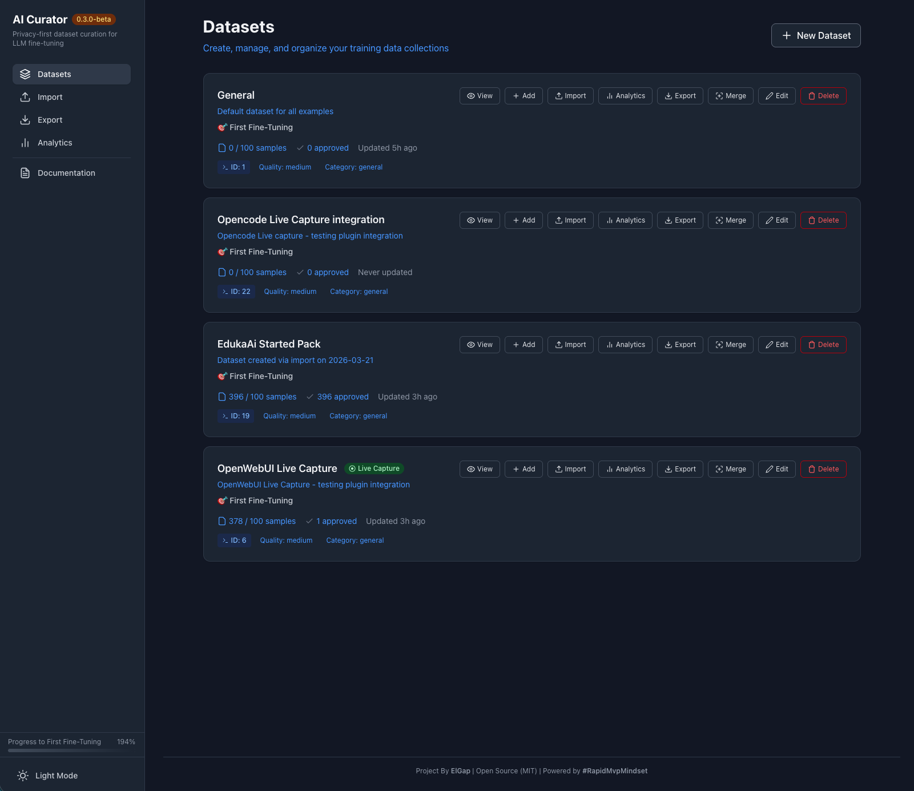

# AI Curator

> **The complete dataset preparation workflow for LLM fine-tuning from raw text to fine-tuned model.**  
> _Collect. Curate. Export. Train._
>
> **Designed exclusively for text-based LLMs** — not for vision or audio models.

[](https://badge.fury.io/js/@elgap/ai-curator)
[](https://github.com/elgap/ai-curator/actions/workflows/ci.yml)
[](https://www.npmjs.com/package/@elgap/ai-curator)
[](https://opensource.org/licenses/MIT)

**Whether you're a professional building production-grade training datasets or a beginner taking your first steps into LLM fine-tuning, it adapts to your workflow.**



**Main Features:**

- **Privacy First** — Local SQLite database. No cloud, no tracking, no telemetry.
- **No Code** — Point, click, curate. No programming required.
- **Zero Configuration** — Install and run. Start collecting in minutes.
- **EdukaAI Starter Pack included** - Start training in 5 minutes with 75 premium samples

**Three ways to work:**

- **Intuitive Web UI** — Point, click, curate. Perfect for beginners.
- \*Powerful CLI\*\* — Automate, script, and integrate. Built for professionals.
- **Live Capture API** — Real-time data streaming from any tool, IDE, or script. Our most powerful feature.

## Why AI Curator?

### For Professionals: Unlimited Versatility

Capture, curate, and export data from virtually any source:

- **Live streaming** — Real-time capture from IDEs, chat interfaces, customer support systems, and internal tools
- **Log processors** — Transform application logs, error reports, and user interactions into training pairs
- **Batch imports** — Ingest massive datasets from Hugging Face, Kaggle, JSON files, CSV exports, or custom pipelines
- **API integration** — HTTP endpoints for any script, tool, or automated workflow to push data
- **Manual refinement** — Human-in-the-loop quality control for mission-critical datasets

### For Beginners: Zero-Code Learning

Start fine-tuning in 5 minutes with no configuration:

- **Pre-loaded starter pack** — 75 premium samples ready to train immediately (included!)
- **Point-and-click curation** — Web UI requires zero technical knowledge
- **One-click export** — Export to training formats without writing any code
- **Visual feedback** — See your dataset quality, progress, and readiness at a glance

**Real-world use cases:**

- **Developers** — Turn IDE interactions and code reviews into coding assistants
- **Support Teams** — Build customer service bots from real ticket resolutions
- **Researchers** — Clean and prepare domain-specific datasets for publication
- **Product Teams** — Transform user feedback and documentation into helpful AI companions
- **Absolute Beginners** — Fine-tune your first LLM in 5 minutes with the pre-loaded starter pack, then use it as a hands-on learning experience to understand how AI training works from zero knowledge

**Export ready for:** Apple MLX or any Alpaca-compatible trainer.

---

## Quick Start

### One-Command Installer (macOS & Linux)

The easiest way to install AI Curator if you have Git installed:

```bash
curl -fsSL https://raw.githubusercontent.com/elgap/ai-curator/main/install.sh | bash
```

This will:

1. Check and install Node.js 20+ if needed
2. Download AI Curator
3. Install all dependencies
4. Build the application
5. Create launch shortcuts

After installation, run:

```bash
cd ai-curator
./launch.sh
```

### NPM (Alternative)

```bash
# One-time use
npx @elgap/ai-curator
```

```bash
# Or install globally
npm install -g @elgap/ai-curator

# Reset database to create default datasets
curator reset --force

# Import the EdukaAI Starter Pack (75 samples for beginners)
curator import EdukaAISP/default-dataset.json --dataset 2 --status approved

# Start the server
curator
```

Open [http://localhost:3333](http://localhost:3333) and start capturing.

---

## 🎁 Built-In Datasets

AI Curator creates **two purpose-built datasets** on first run — your Live Capture Inbox and EdukaAI Starter Pack container. The starter pack with 75 premium samples is imported automatically during installation.

### 📡 Live Capture Inbox (ID: 1)

**Your personal data collection inbox**

- Captures conversations, code snippets, and any text you want to train on
- Perfect for building custom datasets from your daily workflow
- **Disabled by default** — enable in Settings → Live Capture when ready
- Goal: 500 samples for your Personal AI Assistant
- Category: `captured`

### 🎓 EdukaAI Starter Pack (ID: 2) [ACTIVE]

**Start training in 5 minutes with 75 premium samples**

The starter pack is automatically imported during installation. If you need to import it manually:

```bash
curator import EdukaAISP/default-dataset.json --dataset 2 --status approved
```

A curated collection of immersive football training data from the Kingston United vs. Newport County thriller:

- **Player roleplays** — Be Chen Wei, Diego Rodriguez, or Marco Esposito
- **Tactical analysis** — Deep match breakdowns and formation analysis
- **Fan perspectives** — Emotional reactions from both home and away supporters
- **Commentary transcripts** — Professional match narration
- **Alternate history** — "What if" scenarios exploring different outcomes

**Export for training:**

```bash
# Export for Apple Silicon training (MLX format)
curator export --dataset 2 --format mlx --output train.jsonl

# Or export for Unsloth (faster, memory-efficient)
curator export --dataset 2 --format unsloth --output train.jsonl
```

**Perfect for:** Your first LLM fine-tuning experience — see results in ~5 minutes!

---

## The Three Workflows

### 1. Web UI — Visual Curation for Everyone

**Perfect for:** Beginners, visual learners, manual quality control

A clean, intuitive interface that requires zero technical knowledge:

- **Import datasets** via drag-and-drop (JSON, JSONL, CSV)
- **Review samples** in a clear card-based layout
- **Approve or reject** with one click
- **Edit and refine** instructions and outputs
- **Track progress** with visual dashboards
- **Export with one click** to your preferred format

No code. No configuration. Just point, click, and curate.

### 2. CLI — Power Tools for Professionals

**Perfect for:** Automation, scripting, bulk operations, CI/CD integration

When you need to move fast and work at scale:

```bash
# Import 10,000 samples in one command
curator import massive-dataset.jsonl --dataset 1 --workers 8

# Export EdukaAI Starter Pack for immediate training
curator export --dataset 2 --format mlx --output train.jsonl

# Export only approved high-quality samples from any dataset
curator export --dataset 3 --filter "status=approved AND quality>=4" --format mlx

# Search and download from Hugging Face
curator search "python programming"
curator download hf:openai/summarize_from_feedback --dataset 3

# Split for training with stratification
curator export --split "0.8,0.1,0.1" --seed 42 --format jsonl
```

**7 export formats:** Alpaca, ShareGPT, JSONL, CSV, MLX (Apple Silicon), Unsloth, TRL  
**Query language:** Filter by status, quality, category, or full-text search  
**Smart splitting:** Train/test/val with stratification to maintain category balance

### 3. Live Capture API — Real-Time Data Streaming

**Perfect for:** Integration, continuous collection, capturing from live tools

**This is AI Curator's most powerful feature.** Stream training data in real-time from any source via simple HTTP POST:

```bash
# From your IDE, script, or any tool:
curl -X POST http://localhost:3333/api/capture \
  -H "Content-Type: application/json" \
  -d '{
    "source": "my-ide",
    "records": [{
      "instruction": "Explain this error",
      "output": "The error occurs because...",
      "systemPrompt": "You are a coding assistant",
      "category": "coding",
      "qualityRating": 5
    }]
  }'
```

**Why this matters:**

- Capture conversations as they happen — no manual copy-pasting
- Integrate with any tool that can make HTTP requests
- Your product's actual interactions become training data
- Real-time or batched — your choice

**Common integrations:**

- IDE extensions (capture code explanations)
- Chat interfaces (save valuable AI conversations)
- Support systems (turn tickets into Q&A samples)
- Log processors (extract error-resolution pairs)
- Custom scripts (automated data generation)

---

## Complete Data Workflow

### Step 1: Collect (Multiple Ways)

**Live Capture** — Real-time streaming from any tool via API  
**File Import** — Upload existing datasets (JSON, JSONL, CSV)  
**Manual Entry** — Create human-crafted examples in the UI  
**External Sources** — Import from Hugging Face & Kaggle via CLI

### Step 2: Curate (Under Your Supervision)

**Review Workflow:**

- **Draft** — Captured or imported samples waiting for review
- **In Review** — Being evaluated for quality
- **Approved** — High-quality samples ready for training
- **Rejected** — Low-quality or irrelevant samples excluded

**Quality Controls:**

- Rate samples 1-5 stars for quality
- Categorize by domain (coding, writing, Q&A, etc.)
- Tag for organization
- Detect and flag duplicates
- Edit and refine content

### Step 3: Export (Ready for Training)

Export to 7 formats optimized for different training pipelines:

| Format     | Best For            | Notes                            |
| ---------- | ------------------- | -------------------------------- |
| **Alpaca** | General fine-tuning | Standard instruction format      |
| **MLX**    | Apple Silicon       | Optimized for MLX-LM on M1/M2/M3 |
| **JSONL**  | Pipelines           | Line-delimited for streaming     |

**Export Options:**

- Filter by status (approved only, or include drafts)
- Filter by quality (minimum star rating)
- Filter by category or tags
- Train/test/validation splits
- Stratified splitting (maintains category proportions)
- With or without metadata

---

## Live Capture API in Detail

The **Universal Capture API** turns any tool into a training data source. Send data from:

**Development Tools:**

```javascript
// VS Code extension or IDE plugin
fetch("http://localhost:3333/api/capture", {
  method: "POST",
  headers: { "Content-Type": "application/json" },
  body: JSON.stringify({
    source: "vscode-extension",
    records: [
      {
        instruction: "Explain this function",
        output: explanation,
        context: { code, language },
        category: "coding",
      },
    ],
  }),
});
```

**Log Processing:**

```bash
# Extract error-resolutions from logs
tail -f /var/log/app.log | grep "ERROR" | while read line; do
  curl -X POST localhost:3333/api/capture \
    -d "{\"source\":\"logs\",\"records\":[...]}"
done
```

**Chat Interfaces:**

```python
# Python script capturing from any chat
import requests

requests.post('http://localhost:3333/api/capture', json={
    'source': 'chat-interface',
    'records': [{
        'instruction': user_message,
        'output': assistant_response,
        'qualityRating': 4 if user_thumbs_up else 3
    }]
})
```

**Endpoint:** `POST /api/capture`

---

## CLI Reference

For power users who prefer the command line:

| Command                    | Description                                      |
| -------------------------- | ------------------------------------------------ |
| `curator`                  | Start server with web UI (http://localhost:3333) |
| `curator import <file>`    | Import local file (JSON, JSONL, CSV)             |
| `curator export [options]` | Export dataset to training format                |
| `curator search <query>`   | Search Hugging Face and Kaggle                   |
| `curator download <id>`    | Download and auto-import from external source    |
| `curator clear`            | Clear dataset (with confirmation)                |
| `curator reset`            | Reset database to fresh state                    |

**Example Workflows:**

```bash
# Full pipeline: Search → Download → Curate → Export
curator search "medical qa" --limit 5
curator download hf:medalpaca/medical_meadow_small --dataset 1
curator export --dataset 1 --format mlx --output medical-training.jsonl --filter "quality>=4"

# Incremental collection with live capture + periodic export
# (in one terminal) curator  # Start server
# (in another) ./my-capture-script.sh  # Stream data
# (later) curator export --dataset 1 --split "0.8,0.1,0.1" --format jsonl
```

**Environment Variables:**

| Variable              | Default    | Description             |
| --------------------- | ---------- | ----------------------- |
| `AI_CURATOR_PORT`     | 3333       | Server port             |
| `AI_CURATOR_DATA_DIR` | ~/.curator | Where data is stored    |
| `HUGGINGFACE_TOKEN`   | -          | For private HF datasets |

---

## Core Features

### Dataset Management

- Create multiple datasets for different projects
- Set goals and track progress visually
- Organize by purpose: coding, writing, Q&A, roleplay, custom

### Training Sample Management

- **Core fields:** Instruction, Input, Output, System Prompt
- **Metadata:** Category, Difficulty, Quality (1-5), Tags
- **Workflow:** Draft → In Review → Approved/Rejected
- **Bulk operations:** Multi-select approve, categorize, delete

### Quality Control

- **Draft-first capture** — Review before including in training
- **Quality ratings** — Star system for sample ranking
- **Human-in-the-loop** — You approve every sample

---

## Import Formats

AI Curator accepts standard dataset formats:

- **JSON** — Array of objects or JSON Lines
- **JSONL** — Line-delimited JSON (streaming-friendly)
- **CSV** — Comma-separated values with headers

**Smart Auto-Detection:**
Format is automatically detected from file extension and content structure. Supports both standard Alpaca format and custom field mappings.

---

## Privacy & Security

**100% Local-First:**

- SQLite database stored on your machine (`~/.curator/`)
- No cloud services or external APIs (except optional HF/Kaggle downloads)
- No tracking, analytics, or telemetry
- No account required, no data leaves your machine

**You Own Everything:**

- Your data is your data
- Export anytime to any format
- MIT licensed — full transparency

---

## Development

### Tech Stack

- **Frontend:** Vue 3 + Nuxt 4 + Tailwind CSS + Nuxt UI
- **Backend:** Nuxt 4 API routes + Drizzle ORM
- **Database:** SQLite (better-sqlite3)
- **CLI:** Node.js with esbuild bundling

### Build from Source

```bash
git clone https://github.com/elgap/ai-curator.git
cd ai-curator
npm install
npm run dev
```

### Commands

```bash
npm run db:reset      # Reset database
npm run test          # Run tests
npm run build         # Production build
npm run bundle:cli    # Bundle CLI for distribution
npm run lint          # Run ESLint
```

### Project Structure

```
ai-curator/
├── app/              # Nuxt frontend (Vue components, pages)
├── server/           # Backend API routes, CLI commands
├── bin/              # CLI entry point (development)
├── dist/             # Bundled CLI (production)
├── scripts/          # Build and utility scripts
└── docs/             # Documentation
```

## Contributing

We welcome contributions. Contributing guide will be published soon.

---

## License

MIT License — see [LICENSE](LICENSE)

---

[AI Curator](https://github.com/elgap/ai-curator) and [EdukaAI Studio](https://github.com/elgap/edukaai-studio) are part of the [EdukaAI](https://eduka.elgap.ai) project by ElGap — making AI fine-tuning accessible through open-source, privacy-first, no-code tools.

We follow the [#rapidMvpMindset](https://elgap.rs/rapid-mvp-mindset), shipping fast and iterating regularly. Expect frequent updates and improvements!
